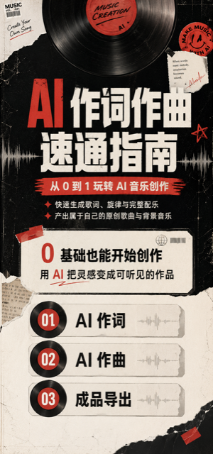

# ai-design-skills

这是一个面向 AI 辅助设计工作的 Codex Skills 仓库。

`ai-design-skills` 是大的 Skill 仓库，不是单个 Skill。每个 Skill 都独立放在 `skills/` 目录下，可以单独安装、单独调用、单独维护。

## 仓库结构

```text
ai-design-skills/
├── skills/
│   ├── mobile-h5-landing-page/   # ai-design-skills-H5 落地页/详情页
│   └── live-preview-poster/      # ai-design-skills-海报
├── assets/
│   └── examples/                 # README 展示用案例图
├── README.md
└── USAGE.md
```

## 当前 Skills

| 对外名称 | 内部触发名 | 适合场景 | 安装路径 |
|---|---|---|---|
| ai-design-skills-H5 落地页/详情页 | `mobile-h5-landing-page` | 手机端 H5、课程详情页、赠课页、长图 | `skills/mobile-h5-landing-page` |
| ai-design-skills-海报 | `live-preview-poster` | 直播预告海报、人物 IP 海报、课程发布海报、活动预热海报 | `skills/live-preview-poster` |

## 安装方式

安装 H5 落地页 Skill：

```bash
python3 ~/.codex/skills/.system/skill-installer/scripts/install-skill-from-github.py \
  --repo AIGC-adu/ai-design-skills \
  --path skills/mobile-h5-landing-page
```

安装海报 Skill：

```bash
python3 ~/.codex/skills/.system/skill-installer/scripts/install-skill-from-github.py \
  --repo AIGC-adu/ai-design-skills \
  --path skills/live-preview-poster
```

安装完成后，重启 Codex。

## ai-design-skills-海报

内部触发名：`live-preview-poster`

主要能力：

- 默认用 image-2 / 图像模型做 9:16 海报风格探索。
- 一次多方案时，每张海报单独生成，不做四宫格。
- 根据主题、风格词、参考图或花瓣画板自动分析视觉风格。
- 支持直播标题、时间、二维码预留位、人物主视觉。
- 选中方向后，可继续精修中文、二维码和人物一致性。

使用示例：

```text
用 $live-preview-poster 帮我做一张 9:16 直播预告海报。

主题：导演思维五步法，让故事身价翻倍
人物：上传照片
时间：5月7日 19:00
二维码：右下角预留
风格：参考我给的图片，整体更热情、更酷炫
```

### 海报案例

| 人像输入 | 海报风格探索 |
|---|---|
|  |  |

| 示例 1 | 示例 2 |
|---|---|
|  |  |

| 示例 3 | 示例 4 |
|---|---|
|  |  |

## ai-design-skills-H5 落地页/详情页

内部触发名：`mobile-h5-landing-page`

主要能力：

- 生成手机端 H5 落地页、课程详情页、平台赠课页和移动端长图。
- 按 750px 手机 H5 宽度组织页面。
- 根据课程内容自动判断适合 2 段还是 3 段。
- 每段单独出图，方便后期上下拼合。
- 根据课程内容自动选择视觉风格，不固定蓝色科技感。
- 平台内赠课详情页默认不加购买、扫码、开始学习、下一步等引导。

使用示例：

```text
用 $mobile-h5-landing-page 帮我生成平台内赠课详情页 H5。

课程名称：
《AI 作词作曲速通指南》

课程介绍：
课程带你从 0 到 1 玩转 AI 音乐创作，包含歌词生成技巧、旋律快速生成、AI 配器与和声、混音与成品导出。

核心卖点：
- 快速上手 AI 音乐生成工具，0 基础也能创作歌曲
- 掌握 AI 作词、作曲、编曲的一体化流程
- 能够为短视频、个人创作、商单音乐配乐提供作品
```

### H5 案例

| AI 写作变现指南 | AI 音乐创作课程 |
|---|---|
|  |  |

| 女性健康科普课程 | AI 写作模块详情 |
|---|---|
|  |  |
